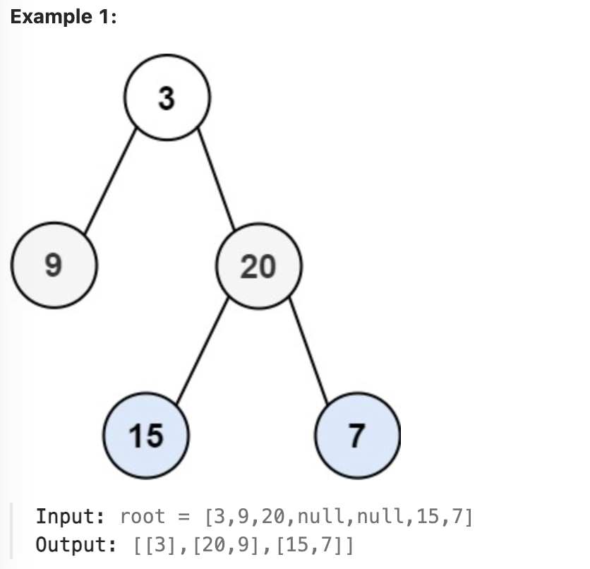

# leetcode - medium
# 103 binary tree zigzag order traverser

Given the root of a binary tree, return the zigzag level order traversal of its nodes' values. (i.e., from left to right, then right to left for the next level and alternate between).

## Example

## Constraints
* The number of nodes in the tree is in the range [0, 2000]
* -100 <= Node.val <= 100

## Solution
### 1. Depth first search
* recursive traverser all node
* if node belongs to left-right direction layer -> push_back
* if node belongs to right-left direction layer -> insert begin
### 2. Breath first search
* pick up all nodes and store as left-right direction
* At the end, explore all right-left layers then reverse the order